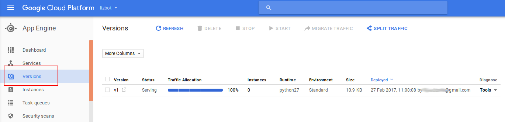

# LizBot

*Deployment of [LanaBot](https://github.com/livz/lanabot) Telegram bot on Google App Engine*

### Steps to add your Telegram bot to Google App Engine and set up [web hooks](https://core.telegram.org/bots/api#getting-updates): ###

1. Create a new code repository on Cloud Platform:
Google Cloud Platform -> Development -> Source code
2. Connect a local repository:
```bash
$ gcloud init
$ git config credential.helper gcloud.sh    
$ git remote add google https://source.developers.google.com/p/fuzzylizbot/r/lizbot
```
  
2. Push changes from local repository to Google Cloud:

```bash
$ git add file1 file2
$ git commit -m "commit message"
$ git push --all google
```

3. Deploy the app:

```bash
$ gcloud app deploy app.yaml --project <project name> -v <version_id> --verbosity=info
```

4. Open app in the browser to test:

```bash
$ gcloud app browse
```

### Management and debugging ###
* Read **_requests logs_** from default application:

```bash
$ gcloud app logs read --service default --limit 10
```

* Stream **_requests logs_** from the command line:

```bash
$  gcloud app logs tail -s default
```

* **_Application logs_** (*including logs from Pytho's logging module*) are generated **per request**, and can be viewed in the console:
  * Google Cloud Platform -> Stackdriver logging -> Logs
  
    
  
  * You can also read the applications logs [via API](https://cloud.google.com/appengine/docs/standard/python/logs/)


* Manage application versions from the console:
  * List all versions:
  
```bash
$ gloud app versions list
```

  * Delete vesions:
  
```bash
$ gcloud app versions delete v1 v2
```

* Manage versions using GUI :
  * Google Cloud Platform -> Stackdriver logging -> Logs
  
    


### References ###
[Google App Engine dashboard](https://console.cloud.google.com/appengine)

[Adding Cloud Source Repositories as Remote](https://cloud.google.com/source-repositories/docs/adding-repositories-as-remotes)

[Telegram Bot API](https://core.telegram.org/bots/api)
